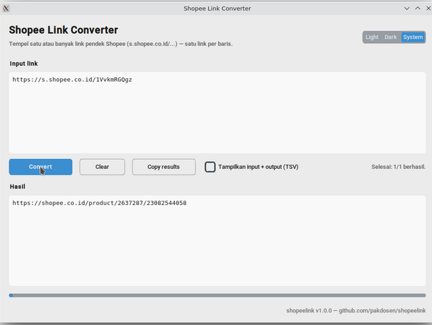
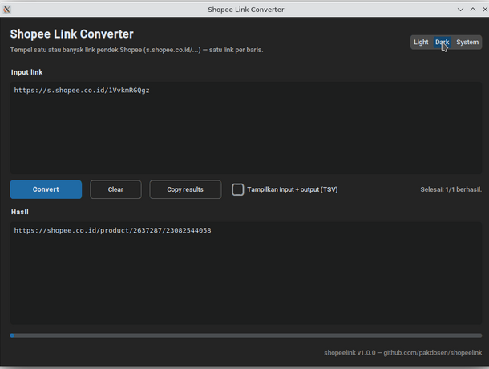
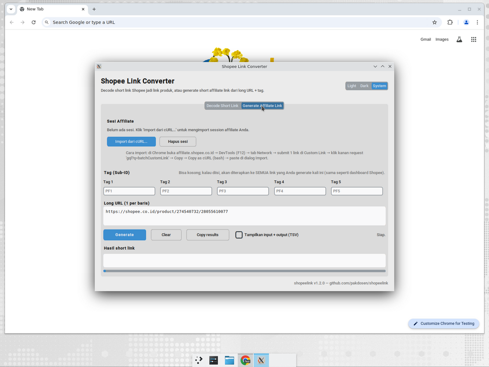
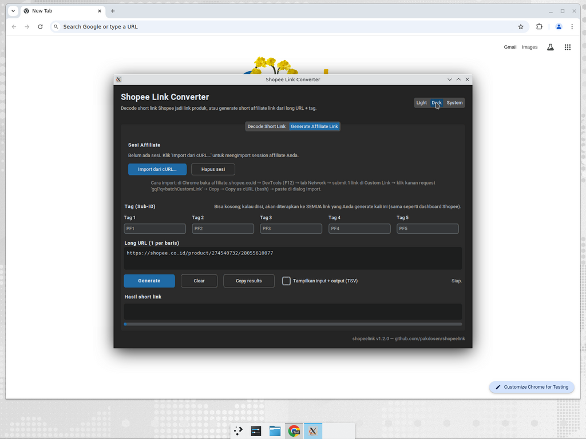

# shopeelink

Tool desktop + CLI untuk dua arah konversi link Shopee:

1. **Decode**: short link → link produk panjang.
2. **Generate Affiliate Link**: long URL → short link affiliate (dengan tag /
   sub-id), persis seperti form **Custom Link** di dashboard Shopee Affiliate.

## Contoh

**Decode short link:**

```
Input  : https://s.shopee.co.id/1VvkmRGQgz
Output : https://shopee.co.id/product/2637287/23082544058

Input  : https://id.shp.ee/keK2a57R
Output : https://shopee.co.id/product/270387150/25170072348
```

Format pendek yang didukung: `s.shopee.co.id/...`, `s.shopee.com.my/...`,
`id.shp.ee/...`, `my.shp.ee/...`, `shp.ee/...`, dst.

**Generate affiliate short link:**

```
Long URL : https://shopee.co.id/product/274540732/28055610077
Tag      : PF1
Output   : https://s.shopee.co.id/901ojkZNEU
```

> Generate link membutuhkan akun Shopee Affiliate Anda. Tool men-drive Chrome
> Anda sendiri (via Playwright dengan `channel="chrome"` — Chromium tidak
> di-download terpisah). Anda login sekali di window Chrome khusus shopeelink,
> lalu Generate berikutnya tinggal klik. Lihat
> [Tab "Generate Affiliate Link"](#tab-generate-affiliate-link).

## Aplikasi Desktop (GUI) — paling mudah

| Light mode | Dark mode |
| :---: | :---: |
|  |  |

Dua cara, pilih salah satu:

### A. Download `.exe` (Windows, tanpa perlu Python)

1. Buka halaman [Releases](https://github.com/pakdosen/shopeelink/releases).
2. Download `ShopeeLinkConverter.exe` dari rilis terbaru.
3. Klik dua kali file `.exe`-nya — aplikasi langsung terbuka.

> Belum ada rilis? Repo owner bisa membuat tag (mis. `v1.0.0`) dan push tag tersebut. GitHub Actions akan otomatis build `.exe` dan attach ke release. Atau jalankan workflow `build-windows` secara manual dari tab **Actions** untuk mendapatkan artifact.

### B. Klik dua kali `run.bat` (Windows) / `run.sh` (Linux/macOS)

1. Pastikan Python 3.10+ sudah terinstal (https://www.python.org/downloads/, **centang "Add Python to PATH"** saat install).
2. Clone atau download repo:
   ```bash
   git clone https://github.com/pakdosen/shopeelink.git
   ```
3. Klik dua kali:
   - **Windows**: `run.bat`
   - **Linux/macOS**: `run.sh` (terminal: `./run.sh` — beri izin eksekusi dengan `chmod +x run.sh` bila perlu)

   Run pertama akan otomatis membuat virtualenv dan menginstal `customtkinter` (~1–2 menit). Setelah itu tinggal dobel-klik dan langsung jalan.

### Tab "Decode Short Link" (default)

1. Tempel link pendek Shopee — satu link per baris — di textarea **Input link**.
2. Klik **Convert**.
3. Hasil muncul di area **Hasil**. Klik **Copy results** untuk salin ke
   clipboard.

### Tab "Generate Affiliate Link"

| Light mode | Dark mode |
| :---: | :---: |
|  |  |

Sekali login (Hubungkan Chrome), Anda bisa generate puluhan/ratusan short
link sekaligus tanpa repot membuka dashboard.

**Persyaratan**: Google Chrome harus terinstal di komputer Anda. Tool akan
menjalankan Chrome Anda dengan profile khusus shopeelink (terpisah dari
profile pribadi Anda) sehingga session login dijaga lokal di
`%APPDATA%\shopeelink\chrome-profile`.

**Setup sekali (Hubungkan Chrome):**

1. Buka aplikasi shopeelink → tab **Generate Affiliate Link** → klik
   **Hubungkan Chrome…**.
2. Sebuah window Chrome muncul di halaman login affiliate.
   Login dengan akun affiliate Anda.
3. Setelah login berhasil, tool otomatis mendeteksi dan menutup window Chrome.
   Status berubah jadi `Profile tersimpan di …`.

Profile Chrome tersimpan lokal:
- Windows: `%APPDATA%\shopeelink\chrome-profile`
- macOS: `~/Library/Application Support/shopeelink/chrome-profile`
- Linux: `~/.config/shopeelink/chrome-profile`

Klik **Reset profile** untuk menghapusnya kalau Anda ingin login dengan akun
yang berbeda.

**Generate link:**

1. Isi tag (Sub-ID) jika perlu — Tag 1 sampai Tag 5. Boleh kosong; kalau
   diisi, tag yang sama akan dipakai untuk semua link batch ini.
2. Tempel long URL di textarea **Long URL** — satu URL per baris.
3. Klik **Generate**. Sebuah window Chrome muncul sebentar untuk mengambil
   data, lalu hasil short link muncul di **Hasil short link**.

> Kalau muncul error login, klik **Hubungkan Chrome…** lagi untuk login
> ulang. Profile session bisa kedaluwarsa setelah beberapa hari, sama seperti
> kalau Anda login di Chrome biasa.

**Kenapa pakai browser, bukan replay cURL?** Endpoint
`batchCustomLink` dilindungi oleh signature anti-bot Shopee
(`X-Sap-Sec`, `Af-Ac-Enc-*`) yang dihitung oleh JS SDK Shopee per-request
berdasarkan body request + timestamp. Replay cURL tidak bekerja karena
signature jadi tidak valid begitu body berubah — hasilnya HTTP 200 dengan
batch kosong (silent reject) atau HTTP 403 dengan `error: 90309999`. Dengan
men-drive Chrome, kita biarkan SDK Shopee yang menandatangani request, jadi
Shopee menerimanya seperti request normal dari dashboard.

## Pemakaian via CLI

### Persyaratan

Python 3.10+ (CLI tidak butuh dependency tambahan; GUI butuh `customtkinter` — lihat `requirements.txt`).

### Satu link

```bash
python shopeelink.py https://s.shopee.co.id/1VvkmRGQgz
```

### Banyak link sekaligus (argumen)

```bash
python shopeelink.py \
    https://s.shopee.co.id/1VvkmRGQgz \
    https://s.shopee.co.id/AbCdEfGhIj
```

### Banyak link via stdin (satu link per baris)

```bash
cat urls.txt | python shopeelink.py
```

### Sertakan input pada output (format TSV)

```bash
python shopeelink.py --show-input https://s.shopee.co.id/1VvkmRGQgz
# https://s.shopee.co.id/1VvkmRGQgz<TAB>https://shopee.co.id/product/2637287/23082544058
```

### Atur timeout HTTP

```bash
python shopeelink.py --timeout 30 https://s.shopee.co.id/1VvkmRGQgz
```

## Cara kerja

1. Untuk link pendek (`s.shopee.*`), tool melakukan request HTTP dan mengikuti
   redirect hingga mencapai URL final.
2. Dari URL final, tool mengekstrak `shop_id` dan `item_id` dari path. Format
   yang didukung:
   - `/product/<shop_id>/<item_id>`
   - `/opaanlp/<shop_id>/<item_id>` (path landing affiliate Shopee)
   - `/<slug>-i.<shop_id>.<item_id>` (slug produk kanonik)
3. URL hasil dibangun ulang menjadi `https://<host>/product/<shop_id>/<item_id>`.

Karena tool ini hanya membaca header redirect, ia jauh lebih ringan dibanding
mengunduh seluruh halaman produk.

## Pemakaian sebagai library

```python
from shopeelink import convert, convert_many

convert("https://s.shopee.co.id/1VvkmRGQgz")
# -> "https://shopee.co.id/product/2637287/23082544058"

for url_in, url_out, err in convert_many(["https://s.shopee.co.id/1VvkmRGQgz"]):
    if err:
        print("gagal:", url_in, err)
    else:
        print(url_in, "->", url_out)
```

## Menjalankan tes

```bash
python -m unittest discover -s tests -v
```

Tes unit tidak melakukan akses jaringan.

## Exit code CLI

- `0` — semua link berhasil dikonversi.
- `1` — minimal satu link gagal (pesan error ditulis ke `stderr`).
- `2` — tidak ada input.

## Build `.exe` Windows secara lokal

Workflow `.github/workflows/build-windows.yml` dijalankan otomatis pada tag
`v*` dan via **Run workflow** (manual). Untuk build sendiri di Windows:

```powershell
python -m venv .venv
.venv\Scripts\activate
pip install -r requirements.txt pyinstaller
pyinstaller --noconfirm --onefile --windowed `
    --name "ShopeeLinkConverter" `
    --collect-all customtkinter `
    --collect-all playwright `
    --collect-binaries playwright `
    shopeelink_gui.py
# Hasil ada di dist\ShopeeLinkConverter.exe
```
